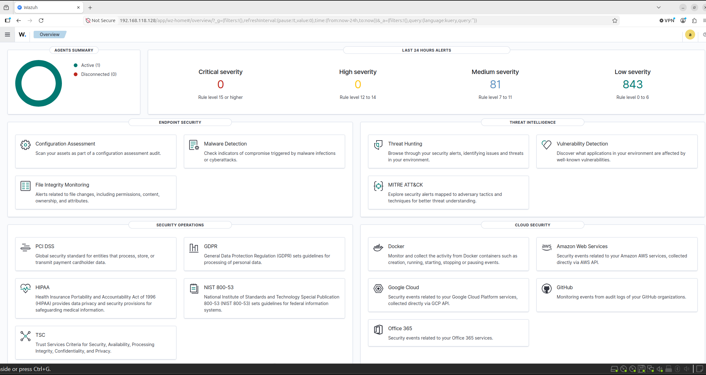

# Wazuh, Caldera, and AI Log Analysis Lab

## Project Overview

This project involved building a cybersecurity lab environment to simulate cyberattacks, monitor security events, and analyze logs using Wazuh, MITRE Caldera, and AI-assisted log analysis.

---

## Step 1: Create the Virtual Machines

Using VirtualBox, I created three virtual machines:

- Ubuntu Server VM (Wazuh Server)
- Windows 10 VM (Target Endpoint)
- Kali Linux VM (Attacker Machine)

### Screenshot: Virtual Machines


---

## Step 2: Install and Configure Wazuh

I installed Wazuh on the Ubuntu Server VM and configured the Wazuh Manager, Indexer, and Dashboard. After installation, I verified all services were running and confirmed access to the web dashboard.

### Screenshot: Wazuh Installation


### Screenshot: Wazuh Dashboard



---

## Step 3: Add the Windows 10 Endpoint

I installed the Wazuh Agent on the Windows 10 virtual machine and registered it with the Wazuh Manager. Once connected, the endpoint began sending logs and security events to the Wazuh server for monitoring.

### Screenshot: Windows Agent Installation


### Screenshot: Endpoint Connected to Wazuh


---

## Step 4: Install Kali Linux and MITRE Caldera

I configured a Kali Linux virtual machine and installed MITRE Caldera. Caldera was used to simulate adversary behavior and execute attack techniques based on the MITRE ATT&CK framework.

### Screenshot: Kali Linux


### Screenshot: Caldera Installation


### Screenshot: Caldera Dashboard


---

## Step 5: Execute Attack Simulations

Using MITRE Caldera, I launched attack simulations against the Windows 10 endpoint. The exercises included reconnaissance, privilege escalation, persistence, and command execution techniques.

### Screenshot: Attack Execution


### Screenshot: MITRE ATT&CK Techniques


---

## Step 6: Monitor and Investigate Alerts in Wazuh

While the attacks were running, Wazuh collected endpoint logs and generated security alerts. I reviewed the alerts, investigated events, and analyzed indicators of compromise (IOCs).

### Screenshot: Security Alerts


### Screenshot: Event Investigation


---

## Step 7: AI-Assisted Log Analysis

I used AI tools to analyze security logs generated during the attack simulations. AI was used to summarize alerts, identify suspicious activity, explain detections, and assist with incident investigation.

### Screenshot: AI Log Analysis


### Screenshot: AI Findings


---

## Skills Demonstrated

- Security Information and Event Management (SIEM)
- Wazuh Administration
- Endpoint Monitoring
- Log Analysis
- Threat Detection
- MITRE ATT&CK Framework
- Adversary Emulation
- Incident Response
- Threat Hunting
- AI-Assisted Security Analysis
- Security Operations Center (SOC) Workflows

---

## Project Architecture

```text
+------------------+
|   Kali Linux     |
| MITRE Caldera    |
+--------+---------+
         |
         | Attack Simulation
         v
+------------------+
|   Windows 10     |
|  Wazuh Agent     |
+--------+---------+
         |
         | Logs & Events
         v
+------------------+
| Ubuntu Server    |
| Wazuh Manager    |
| Wazuh Dashboard  |
+--------+---------+
         |
         | Log Analysis
         v
+------------------+
| AI Analysis Tool |
+------------------+
```

### Screenshot: Architecture Diagram


---

## Conclusion

This lab provided hands-on experience with security monitoring, threat detection, adversary emulation, incident investigation, and AI-assisted log analysis. By combining Wazuh, MITRE Caldera, and AI tools, I gained practical experience with technologies and workflows commonly used by Security Operations Centers (SOCs).
